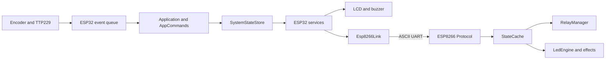

# Architecture

## Scope

The live system consists of two independent Arduino/PlatformIO firmware projects. The ESP32 is the application/controller plane. The ESP8266 is a command-driven execution plane for relays and NeoPixels. They communicate over a direct ASCII UART link.

## Component boundaries

### ESP32

- `firmware/esp32/src/main.cpp` delegates `setup()` and `loop()` to `Application`.
- `app/application.cpp` initializes hardware, runs the boot animation, owns the scheduler, dispatches events, builds LCD frames, and emits diagnostics.
- `app/application_commands.*` is the product-facing mutation layer for lighting, relays, timer, reminders, clock, audio, Wi-Fi initiation, and settings.
- `core/system_state.*` stores canonical relay, lighting, timer, stopwatch, connectivity, audio, settings, and protocol metadata. Mutations increment a revision and enqueue `EVENT_STATE_CHANGED`.
- `core/settings_store.*` loads and saves device settings and five reminders through the ESP32 `Preferences` API.
- `core/persistent_storage.*` stores four relay states as one packed byte in a separate NVS namespace.
- `core/events.*` provides a 64-entry ring queue. Consecutive encoder events of the same type are coalesced.
- `core/scheduler.*` runs the cooperative task table and records runtime/overrun statistics.
- `services/` connects state changes to lighting schedule/backlight, timer completion, protocol synchronization, connectivity observation, and local audio.
- `protocol/` frames/parses UART packets, supervises liveness, retries full sync, retries LED state application, and records UART diagnostics.
- `ui/` renders two 16-character LCD rows. `drivers/` contains the active LCD, RTC, buzzer, and encoder drivers.

### ESP8266

- `src/main.cpp` constructs the state cache, relay manager, LED engine, runtime, watchdog, command queue, and protocol objects.
- `protocol/` accepts framed packets, validates tokens, queues commands, dispatches commands, and emits acknowledgments/errors.
- `state/` stores the mirrored four-relay/LED snapshot and validates `FULL_SYNC` packets.
- `relay/` applies active-low relay outputs.
- `led/` schedules 10 ms NeoPixel frames and renders the five effect types.
- `system/` tracks boot/sync/running/disconnected states, records heartbeats, and recovers stalled protocol/runtime paths.

## ESP32 initialization

`Application::setup()` performs this sequence:

1. Start Serial, fault tracking, settings storage, and settings loading.
2. Initialize `SystemStateStore`, navigation, idle management, and relay-state NVS restoration.
3. Initialize the local LCD, custom LCD character, and buzzer.
4. Start the DS1307 driver. If it cannot be initialized, display `RTC ERROR` and remain in a delay loop. If the RTC is not running, adjust it to the compile timestamp.
5. Start services, encoder input, and TTP229 polling.
6. Apply the canonical backlight state and load reminders.
7. Run the boot animation, initialize the clock feature, clear the LCD cache, reset scheduler statistics, and enter the main loop.

## ESP32 runtime schedule

The scheduler is cooperative and runs from `Application::loop()` followed by a 1 ms delay. The configured tasks are:

| Task | Interval | Responsibility |
| --- | ---: | --- |
| `esp8266-link` | every loop | Receive UART data and supervise link/sync/LED state |
| `buzzer` | 5 ms | End active buzzer pulses |
| `hardware` | every loop | Execute queued local hardware requests |
| `lighting` | 1 s | Re-evaluate the automatic lighting schedule |
| `timer` | 50 ms | Update countdown and timer alarm timing |
| `reminder-check` | 1 s | Detect due reminders |
| `reminder-alarm` | 50 ms | Beep an active reminder alarm and time it out |
| `nav-monitor` | every loop | No-op; navigation monitoring is in `EncoderDriver` |
| `input` | 10 ms | Read TTP229 and encoder events |
| `events` | every loop | Dispatch queued events and apply idle auto-return |
| `ui` | 50 ms | Commit navigation and render/flush changed LCD rows |
| `diagnostics` | 30 s | Emit scheduler, LCD, LED, UART, and fault diagnostics over Serial |

## Event and state flow

Input events are queued by `InputService`, then drained by `Application::processEvents`. Services see each event first; application handlers then update navigation/features. State mutations enqueue `EVENT_STATE_CHANGED`, which drives protocol and local lighting reactions. The UI reads feature/state data and writes an LCD frame; the LCD driver caches characters and writes only changed runs.

`SystemStateStore` is canonical for controller state. The ESP8266 `StateCache` is a mirror used to apply the latest relay snapshot and LED state; it does not schedule application alarms or own user settings.

## Navigation

`NavigationStack` stores up to eight `AppState` values and starts at `STATE_CLOCK`. The main-screen rotation order is Clock, Timer, Stopwatch, Reminders, Settings. Nested screens are pushed through `AppNavigation::enter`; the back operation pops the stack. A 1000 ms encoder hold emits `EVENT_LONG_PRESS` and the current application handler resets navigation to Clock, except that any interaction while a reminder alarm is active stops that alarm first.

## Failure and recovery paths

- RTC initialization failure is fatal to the application loop after showing `RTC ERROR`.
- Full-sync build/send failure, heartbeat timeout, serial failure, malformed-packet bursts, and ESP8266 error packets enter ESP32 link recovery.
- ESP32 retries sync every 1000 ms up to five attempts, waits 1500 ms between recovery attempts, and reinitializes `Serial2` after three recovery attempts.
- LED state application waits 750 ms for an acknowledgment and retries up to three times with bounded backoff.
- ESP8266 rejects malformed/oversized/unknown/invalid commands with `ERR` responses. Its watchdog clears the protocol packet state and command queue after sync or runtime stalls, then returns the runtime to `WAITING_FOR_SYNC`.

## Known boundary/maintenance findings

- `firmware/esp32/src/drivers/neopixel_driver.cpp` is compiled but not called by the live `Application`; current LED output is delegated to the ESP8266.
- `firmware/esp32/src/app/navigation_manager.cpp` and `firmware/esp32/src/features/lighting.cpp` are present but the live application uses `AppNavigation`/`NavigationStack` and `LightingService` instead.
- Wi-Fi status observation and a `connectWifi` API exist, but no credentials/configuration or connection workflow is wired into the UI or deployment process.
- `src/` contains an older scheduler/logging scaffold and is not referenced by either current `platformio.ini`.
