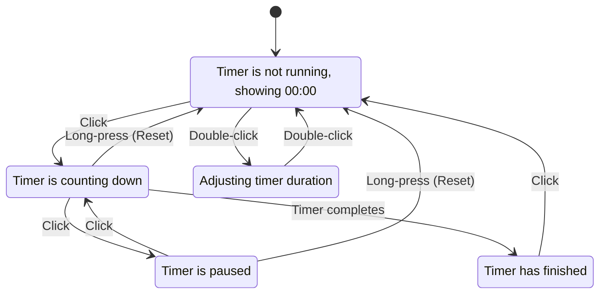

```mermaid
stateDiagram-v2
    [*] --> IDLE

    IDLE: Timer is not running, showing 00:00
    IDLE --> RUNNING: Click
    IDLE --> EDITING: Double-click

    RUNNING: Timer is counting down
    RUNNING --> PAUSED: Click
    RUNNING --> IDLE: Long-press (Reset)
    RUNNING --> ALARM: Timer completes

    PAUSED: Timer is paused
    PAUSED --> RUNNING: Click
    PAUSED --> IDLE: Long-press (Reset)

    EDITING: Adjusting timer duration
    EDITING --> IDLE: Double-click

    ALARM: Timer has finished
    ALARM --> IDLE: Click
```