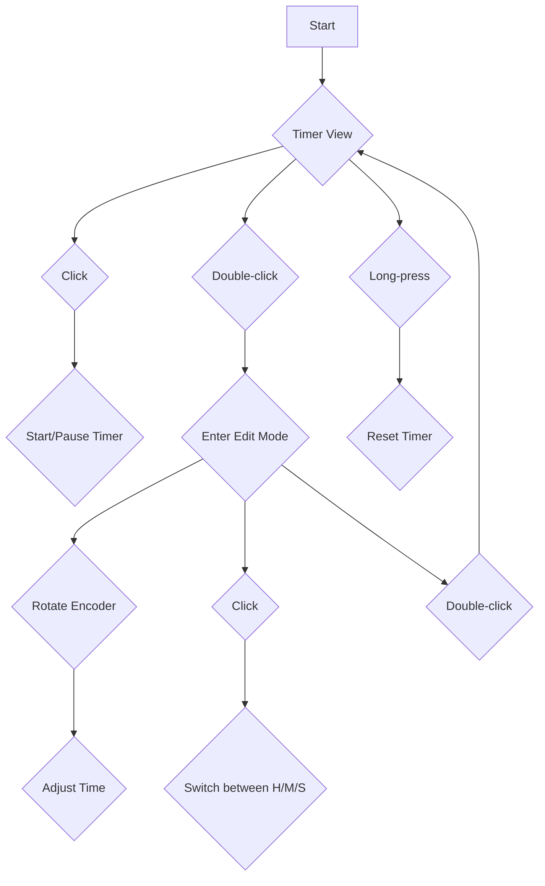

```mermaid
graph TD
    A[Start] --> B{Timer View};

    B --> C{Click} --> D{Start/Pause Timer};
    B --> E{Double-click} --> F{Enter Edit Mode};
    B --> G{Long-press} --> H{Reset Timer};

    F --> I{Rotate Encoder} --> J{Adjust Time};
    F --> K{Click} --> L{Switch between H/M/S};
    F --> M{Double-click} --> B;
```